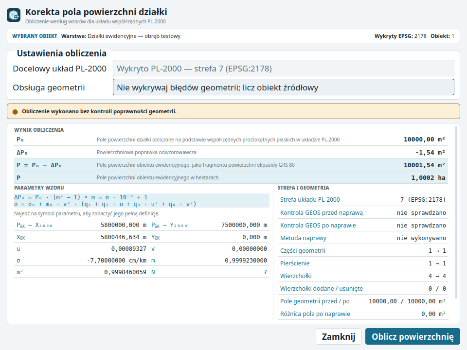

<p align="center">
  
</p>

# Poprawka odwzorowawcza

Wtyczka QGIS do obliczania ustawowego pola działki ewidencyjnej
z powierzchniową poprawką odwzorowawczą w układzie PL-2000. Udostępnia
czytelny dialog dla jednej zaznaczonej działki oraz algorytm Processing do
obliczeń seryjnych.

> 🤖 **Transparentność rozwoju:** projekt powstaje z wykorzystaniem podejścia
> vibe coding. Kod, wzór, zachowanie na danych brzegowych i paczka wydaniowa
> są weryfikowane testami automatycznymi, skanerami oraz ręcznym przeglądem.

**Status:** kandydat stabilnego wydania `1.0.0`. Automatyczne testy wykonano
w QGIS 3.40.15 / Qt 5.15 na Linuksie. `metadata.txt` deklaruje QGIS
3.40–3.x; QGIS 4 nie jest jeszcze deklarowany. Przed publikacją pozostaje
ręczny test finalnego ZIP-u zgodnie z
[checklistą wydania](docs/PUBLISHING.md).



## Najważniejsze możliwości

- obliczenie `P = P₀ − ΔP₀` bez zaokrąglania wartości pośrednich;
- automatyczne rozpoznanie strefy dla EPSG:2176–2179;
- ręczny, jawny wybór strefy PL-2000 dla innych CRS;
- dwa tryby geometrii: źródłowa kopia bez GEOS oraz kontrola z opcjonalną
  naprawą kopii;
- pełna diagnostyka w nowej warstwie wynikowej Processing;
- brak modyfikacji warstwy wejściowej, komunikacji sieciowej i zależności
  instalowanych przez pip.

## Instalacja

### Oficjalne repozytorium QGIS

Po zatwierdzeniu wydania otwórz w QGIS **Wtyczki → Zarządzanie i instalowanie
wtyczek**, wyszukaj „Poprawka odwzorowawcza” i wybierz
**Zainstaluj wtyczkę**.

### Kandydat wydania z ZIP

1. Pobierz ZIP dołączony do oznaczonego wydania GitHub.
2. W QGIS wybierz **Wtyczki → Zarządzanie i instalowanie wtyczek →
   Instaluj z ZIP**.
3. Wskaż archiwum i zaakceptuj instalację.

Nie instaluj przypadkowego pliku z lokalnego `dist/`. Paczka przeznaczona do
publikacji musi odpowiadać oznaczonemu commitowi i opublikowanej sumie
SHA-256.

## Użycie

### Jedna działka

1. Aktywuj warstwę Polygon lub MultiPolygon i zaznacz dokładnie jeden obiekt.
2. Uruchom **Wektor → Poprawka odwzorowawcza → Oblicz powierzchnię
   zaznaczonej działki** albo użyj przycisku na pasku narzędzi.
3. Dla CRS innego niż EPSG:2176–2179 wskaż właściwą strefę PL-2000.
4. Wybierz sposób obsługi geometrii i uruchom obliczenie.

### Wiele działek

W **Panelu Algorytmów Processingu** wyszukaj **Oblicz powierzchnię działek
EGiB**. Wskaż warstwę, strefę, sposób obsługi geometrii i docelową warstwę
wynikową.

Do zachowania pełnych nazw pól i diagnostyki używaj GeoPackage. Shapefile
ogranicza nazwy pól do 10 znaków i tekst do 254 znaków, dlatego może zmienić
schemat oraz uciąć pole `egib_warnings`.

## Tryby i ograniczenia

| Obszar | Zachowanie |
|---|---|
| Zasięg | Polska, strefy PL-2000 5–8 |
| CRS | automatycznie EPSG:2176–2179; pozostałe wymagają wyboru strefy |
| Geometria | Polygon/MultiPolygon; pierścienie krzywe są odrzucane |
| Punkty PGK | wierzchołki geometrii, nie niezależny rejestr punktów EGiB |
| Tryb domyślny | oblicza z kopii bez `isGeosValid()` i `makeValid()` |
| Tryb naprawy | sprawdza GEOS i może naprawić wyłącznie kopię |
| Limity | 10 000 części, 50 000 pierścieni, 500 000 współrzędnych |
| Wynik seryjny | nowa warstwa; źródło pozostaje bez zmian |

Wynik nie zastępuje kontroli właściwego CRS, strefy, pochodzenia punktów
granicznych ani aktualnego stanu prawnego. Szczegóły opisuje
[podstawa prawna](docs/LEGAL_BASIS.md).

## Prywatność i bezpieczeństwo

Wtyczka przetwarza geometrię lokalnie w pamięci QGIS. Nie wykonuje zapytań
sieciowych, nie wymaga konta ani usług zewnętrznych i nie przechowuje
poświadczeń. Transformacja oraz naprawa działają na kopiach geometrii.

Błędy funkcjonalne zgłaszaj przez
[Issues](https://github.com/jaroslaw-sadowski/qgis-poprawka-odwzorowawcza/issues).
Podatności zgłaszaj prywatnie zgodnie z [SECURITY.md](SECURITY.md).

## Rozwój i walidacja

Instrukcje przygotowania środowiska, konwencję gałęzi i wymagania pull
requestów opisuje [CONTRIBUTING.md](CONTRIBUTING.md). Minimalny zestaw
kontroli:

```bash
ruff check --no-cache .
ruff format --check --no-cache .
flake8 . --exclude=legacy,__pycache__ --jobs 1
bandit -r __init__.py compat.py plugin.py user_messages.py \
  adapters core gui processing_provider scripts
pytest -p no:cacheprovider
python scripts/build_plugin_zip.py
```

Kod runtime korzysta wyłącznie z biblioteki standardowej Python i API QGIS.
Plik `requirements-dev.txt` zawiera tylko narzędzia deweloperskie.

## Projekt

- [Changelog](CHANGELOG.md)
- [Publikacja wydania krok po kroku](docs/PUBLISHING.md)
- [Polityka bezpieczeństwa](SECURITY.md)
- [Raport walidacji wydania](docs/RELEASE_VALIDATION.md)
- [Audyt bezpieczeństwa i jakości](docs/SECURITY_AUDIT_2026-07-24.md)
- [Licencja GNU GPL v2](LICENSE)

Autor i opiekun: [Jarosław Sadowski](https://github.com/jaroslaw-sadowski).
Projekt jest aktywnie utrzymywany.
